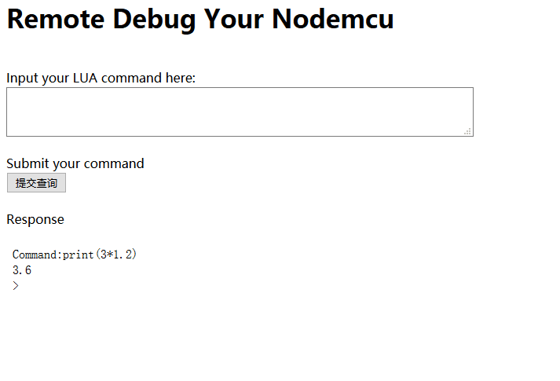

# nodemcu-HTTP-web-console
This is a lua program based on nodemcu-firmware for ESP8266. By running this, You could debug your nodemcu on mobile phone with web browser.

The project contains four files.All of then is needed to upload into the nodmecu.
- `wf4.lua`, the web server executed on esp8266
- `form2.html`, the home-page of web server, using POST method, transform your command into webserver
- `print.txt`,  embeded in homepage, show the serial response message of nodemcu. 
- `favcion.ico`, the favicon of websever.

The interface is shown below:
  
